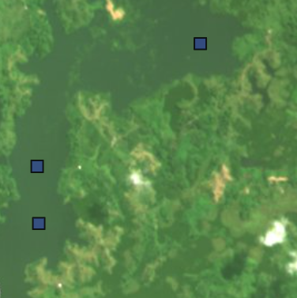
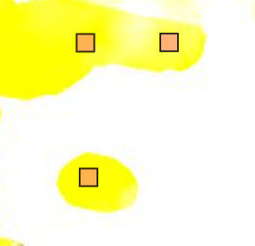

# Training Polygon Classification Guide

This guide provides visual examples and guidelines for drawing training polygons for each classification class in the ChocoForestWatch system.

## Classification Classes

### 1. Forest 🌲

**Description:** Areas covered by dense forest canopy, including primary and secondary forest, and likely some tree crops such as cacao and palm oil.

**Characteristics:**
- Dense green canopy coverage
- Continuous tree cover
- Minimal visible gaps
- Natural forest texture

**Example Images:**
| Example 1 | Example 2 | Example 3 | Example 4 | Example 5 |
|-----------|-----------|-----------|-----------|-----------|
|  |  |  |  |  |

| Example 6 | Example 7 | Example 8 | Example 9 | Example 10 |
|-----------|-----------|-----------|-----------|-----------|
|  |  |  |  |  |

---

### 2. Non-forest 🏞️

**Description:** Areas without forest cover, including agricultural land, urban areas, grasslands, and cleared land.

**Characteristics:**
- Visible ground or non-forest vegetation
- Agricultural fields or pastures
- Urban/built-up areas
- Cleared or deforested areas

**Example Images:**
| Example 1 | Example 2 | Example 3 | Example 4 | Example 5 |
|-----------|-----------|-----------|-----------|-----------|
|  |  |  |  |  |

| Example 6 | Example 7 | Example 8 | Example 9 | Example 10 |
|-----------|-----------|-----------|-----------|-----------|
|  |  |  |  |  |

---

### 3. Cloud ☁️

**Description:** Areas obscured by clouds, appearing as white or light-colored masses.

**Characteristics:**
- Bright white or light gray appearance
- Fluffy or smooth texture
- Casts shadows on surrounding areas
- Completely or mostly obscures ground features

**Example Images:**
| Example 1 | Example 2 | Example 3 | Example 4 | Example 5 |
|-----------|-----------|-----------|-----------|-----------|
|  |  |  |  |  |

| Example 6 | Example 7 | Example 8 | Example 9 | Example 10 |
|-----------|-----------|-----------|-----------|-----------|
|  |  |  |  |  |

---

### 4. Shadow 🌑

**Description:** Areas in shadow, typically cast by clouds or topographic features.

**Characteristics:**
- Dark appearance with reduced visibility
- Often adjacent to clouds or elevated terrain
- Distinguishable from water by location context
- May still show some ground features
- Can be confused with dense forest

**Example Images:**
| Example 1 | Example 2 | Example 3 | Example 4 | Example 5 |
|-----------|-----------|-----------|-----------|-----------|
|  |  |  |  |  |

| Example 6 | Example 7 | Example 8 | Example 9 | Example 10 |
|-----------|-----------|-----------|-----------|-----------|
|  |  |  |  |  |

---

### 5. Water 💧

**Description:** Rivers, lakes, ponds, and other water bodies.

**Characteristics:**
- Dark blue to black appearance, or brownish depending on location and
- Smooth surface texture
- Well-defined boundaries
- May reflect surrounding features

**Example Images:**
| Example 1 | Example 2 | Example 3 | Example 4 | Example 5 |
|-----------|-----------|-----------|-----------|-----------|
|  |  |  |  |  |

| Example 6 | Example 7 | Example 8 | Example 9 | Example 10 |
|-----------|-----------|-----------|-----------|-----------|
|  |  |  |  |  |

---

### 6. Haze 

**Description:** Areas with atmospheric haze or thin cloud cover that partially obscures ground features.

**Characteristics:**
- Key characteristic is that its transparent - ground features still partially visible in most cases
- Misty or foggy appearance
- Reduced contrast and visibility
- Lighter than shadows but not as bright as clouds
- Can sometimes appear as sensor error as coloring of the haze can be yellow / purple

**Example Images:**
| Example 1 | Example 2 | Example 3 | Example 4 | Example 5 |
|-----------|-----------|-----------|-----------|-----------|
|  |  |  |  |  |

| Example 6 | Example 7 | Example 8 | Example 9 | Example 10 |
|-----------|-----------|-----------|-----------|-----------|
|  |  |  |  |  |

| Example 11 | Example 12 | Example 13 | Example 14 | Example 15 |
|-----------|-----------|-----------|-----------|-----------|
|  |  |  |  |  |

---

### 7. Sensor Error ⚠️

**Description:** Areas with sensor malfunctions, data corruption, or other technical issues.

**Characteristics:**
- Unusual colors or patterns
- Striping or banding artifacts
- Missing data (black or white strips)
- Geometrically distorted features
- Often purple / yellow / blue or other solid colors

**Example Images:**
| Example 1 | Example 2 | Example 3 | Example 4 | Example 5 |
|-----------|-----------|-----------|-----------|-----------|
|  |  |  |  |  |

| Example 6 | Example 7 | Example 8 | Example 9 | Example 10 |
|-----------|-----------|-----------|-----------|-----------|
|  |  |  |  |  |
